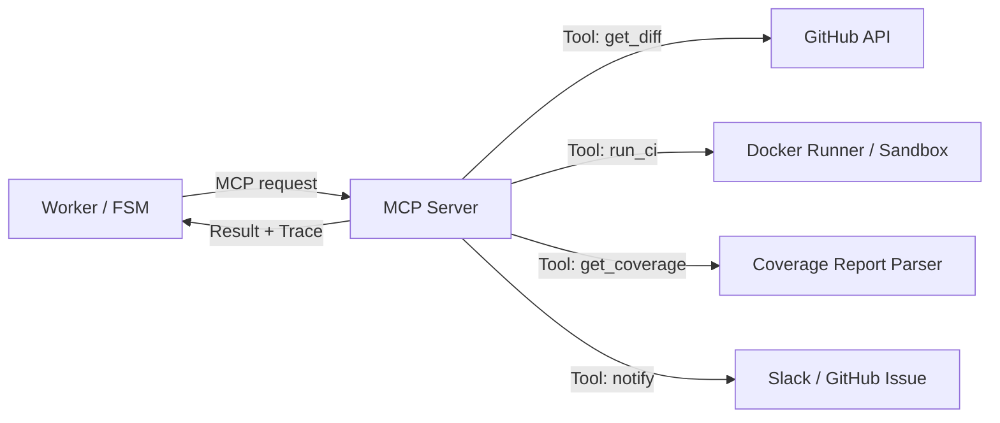
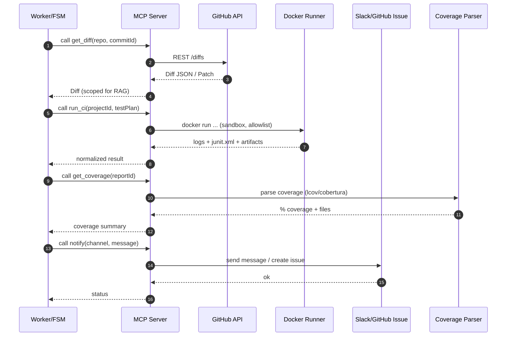

# 🛠️ InsightTestAI — MCP Server (Model Context Protocol)

> Cung cấp bộ **tools** chuẩn hoá cho LLM/Worker sử dụng thông qua **MCP**.
> Mục tiêu: *an toàn, có kiểm soát (allowlist), có timeout, có trace*, và **tối ưu ngữ cảnh** cho Agent.

---

## 1) Kiến trúc tổng quan





---

## 2) Danh sách Tool (Contracts)

Tất cả tools phải:
- Có **schema** input/output rõ ràng.
- Có **timeout**, **allowlist** và **trace-id**.
- Trả **error code** + **message** có thể chẩn đoán.

### 2.1 `get_diff`
- **Input** (JSON):
  ```json
  {
    "repo": "org/name",
    "commitId": "abc123",
    "paths": ["src/", "tests/"],
    "maxPatchBytes": 262144
  }
  ```
- **Output** (JSON):
  ```json
  {
    "commitId": "abc123",
    "files": [
      {
        "path": "src/service/A.java",
        "status": "modified",
        "patch": "@@ -10,6 +10,9 @@ ...",
        "hunks": []
      }
    ],
    "scopedContext": "Summarized and chunked context for RAG"
  }
  ```

### 2.2 `run_ci`
- **Input** (JSON):
  ```json
  {
    "projectId": "p-123",
    "testPlan": "Given-When-Then steps ...",
    "runner": {
      "image": "node:20",
      "workdir": "/app",
      "cmd": ["npm","test","--","--reporter=junit"]
    },
    "artifacts": ["junit.xml","coverage/lcov.info"],
    "timeoutSec": 900
  }
  ```
- **Output** (JSON):
  ```json
  {
    "status": "passed | failed | error | timeout",
    "durationMs": 123456,
    "logs": "tail -n 2000 ...",
    "artifacts": [
      {"name": "junit.xml", "path": "/artifacts/junit.xml"},
      {"name": "lcov.info", "path": "/artifacts/coverage/lcov.info"}
    ],
    "traceId": "mcp-xyz-123"
  }
  ```

### 2.3 `get_coverage`
- **Input** (JSON):
  ```json
  { "reportId": "cov-2025-08-20-001", "format": "lcov" }
  ```
- **Output** (JSON):
  ```json
  {
    "statements": 82.4,
    "branches": 75.1,
    "functions": 80.0,
    "lines": 83.2,
    "files": [{"path":"src/A.java","lines":91.2}]
  }
  ```

### 2.4 `notify`
- **Input** (JSON):
  ```json
  { "channel": "slack:#qa-alerts", "message": "Run 123 failed at TOOLING", "level": "error" }
  ```
- **Output** (JSON):
  ```json
  { "ok": true, "endpoint": "slack", "messageId": "ts-1724138112.000200" }
  ```

---

## 3) Chính sách an toàn & vận hành

- **Allowlist** tool & tham số nhạy cảm.
- **Timeout/Retry** có backoff; cắt log lớn.
- **Sandbox** runner: Docker rootless, network policy.
- **Observability**: trace-id, structured logs, audit trail.
- **Resource limits**: CPU/Memory/IO quotas cho job.

---

## 4) ENV & cấu hình mẫu

Bắt buộc:
- `GITHUB_TOKEN`
- `SLACK_WEBHOOK_URL` (hoặc `GITHUB_APP_ID/PRIVATE_KEY` nếu mở Issue)
- `DOCKER_RUNNER_IMAGE_DEFAULT`
- `ARTIFACTS_DIR`

Tuỳ chọn:
- `MCP_PORT` (mặc định 8081)
- `ALLOWED_TOOLS` (CSV)
- `TOOL_TIMEOUT_SEC` (mặc định 900)

---

## 5) Chạy cục bộ

```bash
npm ci
npm run mcp

# Kiểm thử nhanh (pseudo)
curl -X POST localhost:8081/tools/get_diff -d '{"repo":"org/app","commitId":"abc"}'
```

---

## 6) Contract & Versioning

- Tất cả tool specs publish dưới dạng JSON Schema trong `/contracts`.
- SemVer cho phiên bản MCP: breaking changes bump **MAJOR**.
- Embed `schema_version` trong mỗi response để tương thích ngược.
