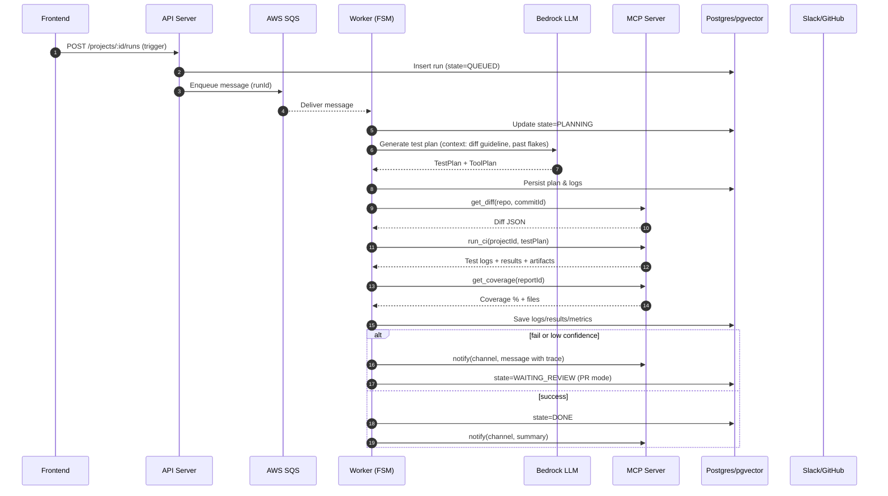
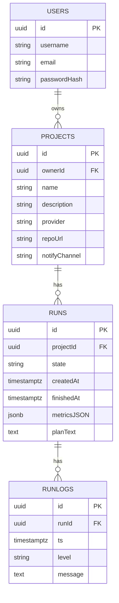

# 🚀 InsightTestAI — Orchestrator Worker (FSM Engine)

> Service nền chịu trách nhiệm chạy **Agent Run** theo mô hình **Agentic workflow**: *Plan → Act (tool) → Observe → Adjust → Done/Error*.
> Worker tuân thủ nguyên tắc: **RAG theo ngữ cảnh mã nguồn**, **self-check**, **uncertainty-aware**, **đo đạc** và **flywheel**.

---

## 1) Kiến trúc & Luồng chính

```mermaid
flowchart TD
    A[SQS message: ProjectRun/CommitHook] --> B[Worker - FSM Engine]
    B --> C{State}
    C -->|Planning| D[Call Bedrock LLM\nSinh Test Plan + Tool Plan\n(RAG theo diff + guideline)]
    C -->|Tooling| E[Invoke MCP Tools\n- get_diff\n- run_ci\n- get_coverage\n- notify]
    C -->|Observing| F[Thu thập log/kết quả\nPersist DB (Runs/RunLogs)\nMetrics JSON]
    C -->|Adjusting| G[Retry/Fallback\nDegrade: Auto-commit → PR]
    C -->|Done/Error| H[Update state, metrics\nEmit events/notify]
    D --> E
    E --> F
    F --> G
    G --> C
    F --> H
```



---

## 2) FSM States

| State         | Mô tả ngắn | Hành động chính | Kết quả |
|---|---|---|---|
| `PLANNING`    | Phân tích commit/diff, build TestPlan | Gọi Bedrock LLM (RAG: guideline + lịch sử flake); tạo ToolPlan | `TOOLING` |
| `TOOLING`     | Thực thi tool theo kế hoạch | Gọi MCP: `get_diff`, `run_ci`, `get_coverage` | `OBSERVING` |
| `OBSERVING`   | Thu thập & đánh giá kết quả | Ghi DB; đánh giá confidence | `ADJUSTING`/`DONE`/`ERROR` |
| `ADJUSTING`   | Retry/fallback/degrade | Giảm cấp sang PR nếu low confidence | Về vòng lặp hoặc `DONE/ERROR` |
| `DONE/ERROR`  | Kết thúc run | Lưu metrics, notify | — |

**Uncertainty-aware**: nếu `confidence < threshold` → **degrade**: chuyển từ auto-commit sang tạo **PR** kèm trace và checklist tự review (*static check*, *dry-run*).

---

## 3) Cấu hình môi trường (ENV)

Bắt buộc:
- `AWS_REGION`
- `SQS_QUEUE_URL`
- `DB_URL` (Postgres)
- `BEDROCK_MODEL_ID` (vd: `anthropic.claude-3.5-sonnet` trên Bedrock)
- `MCP_SERVER_URL`

Tuỳ chọn / tích hợp:
- `RAG_GUIDELINE_STORE` (S3/DB path guideline)
- `MAX_RETRY`, `CONFIDENCE_THRESHOLD`
- `SLACK_DEFAULT_CHANNEL`, `GITHUB_REPO_DEFAULT`

---

## 4) Lược đồ DB tối thiểu



---

## 5) Triển khai & chạy cục bộ

```bash
# 1) Cài deps
npm ci

# 2) Chạy worker
npm run worker

# 3) Mẹo debug
# - Tạo 1 message giả vào SQS
# - Gắn LOG_LEVEL=debug để xem state transition
```

---

## 6) Chính sách & tiêu chí chất lượng

- **Self-check**: static check + dry-run trước khi merge test.
- **Metrics**: precision test-relevance, flakiness, time-to-detect, coverage.
- **Flywheel**: logs/kết quả/feedback dev → cải tiến prompt/heuristic.
- **Sandbox**: mọi thực thi test đều trong container cô lập.
- **Allowlist tools** qua MCP; timeout và trace đầy đủ.
